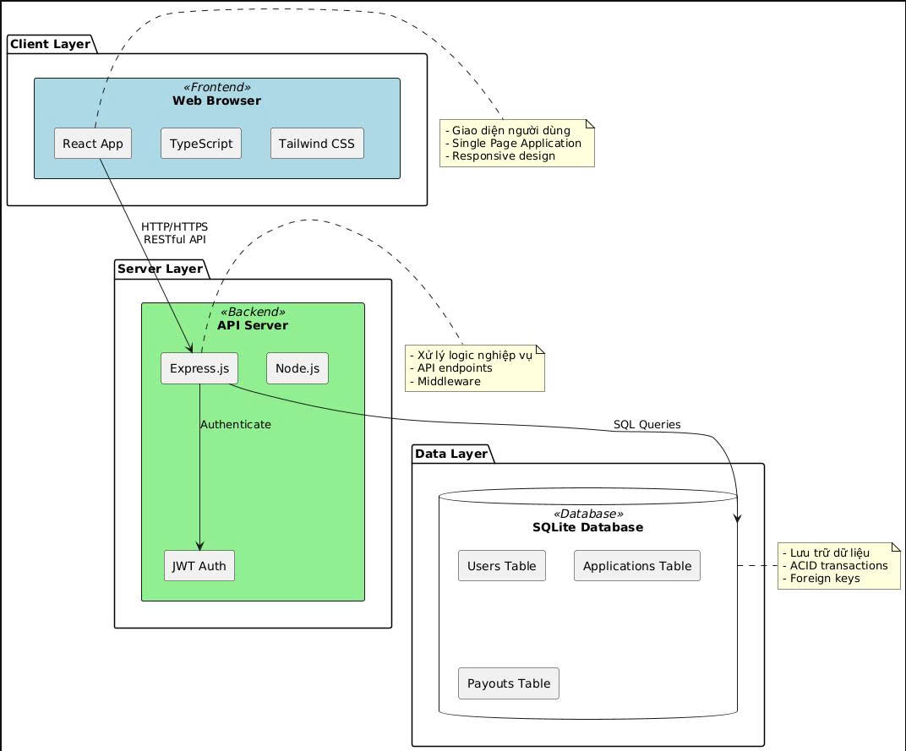
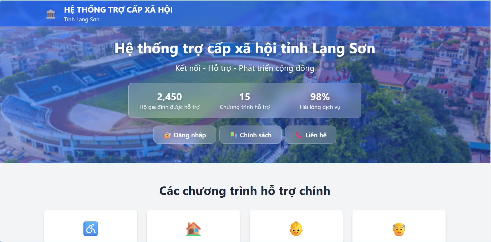
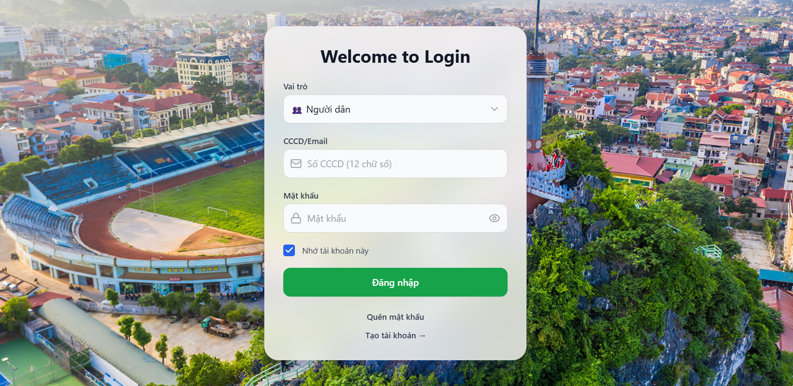
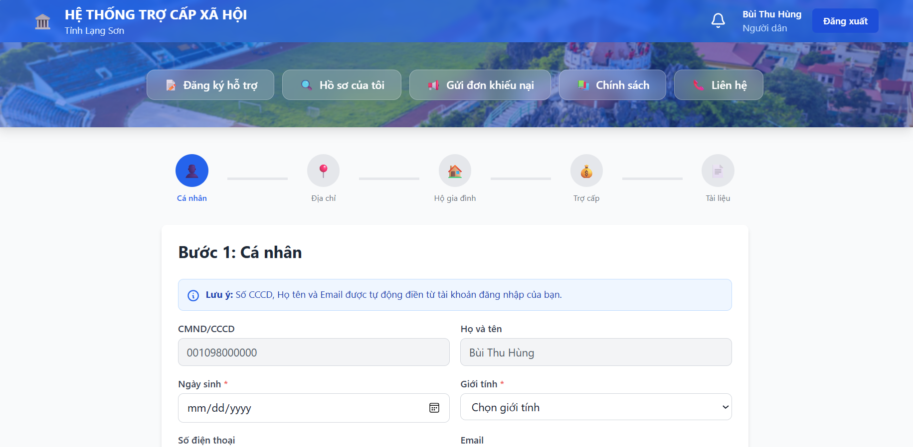
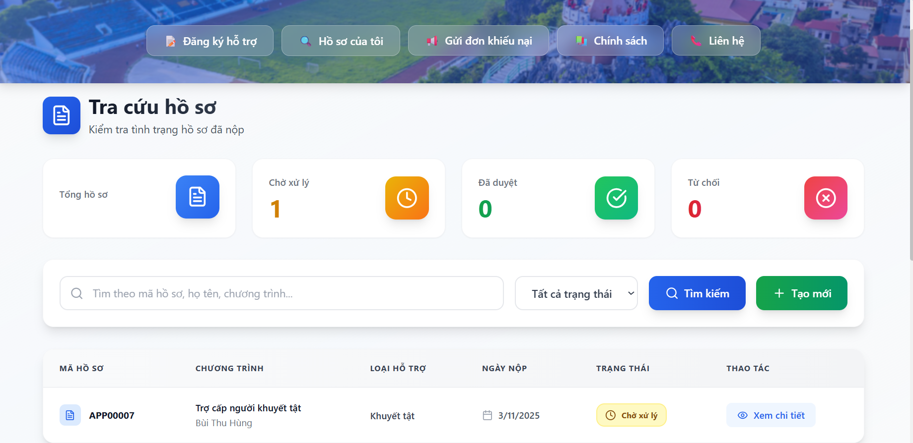
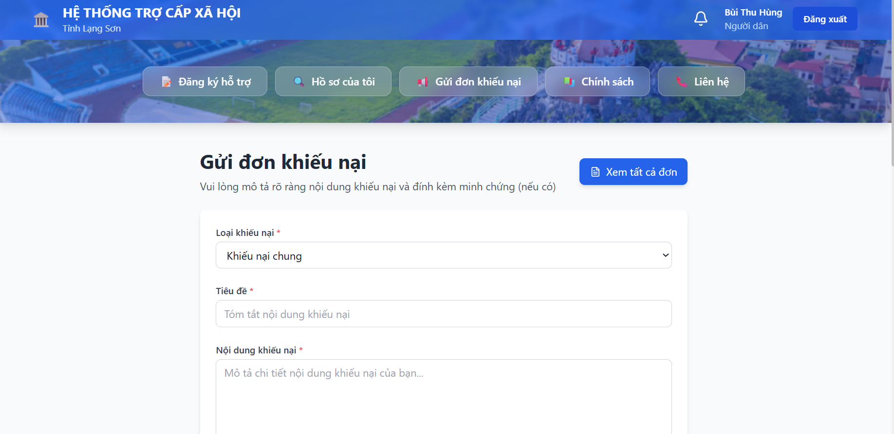
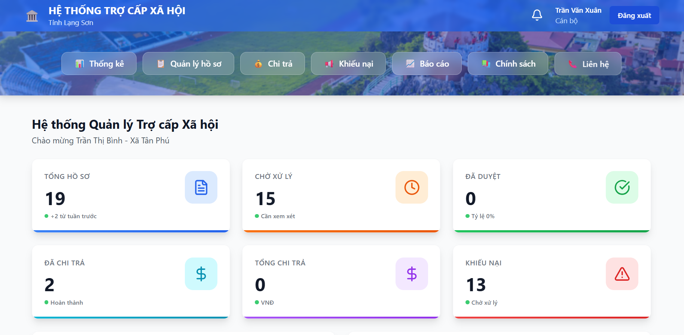
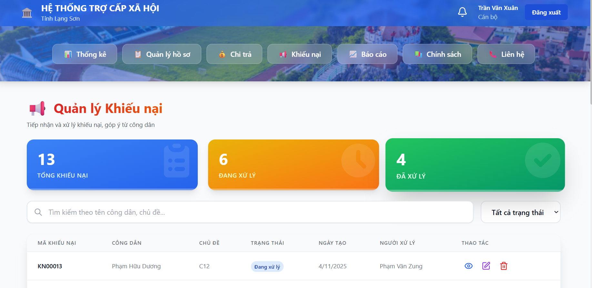
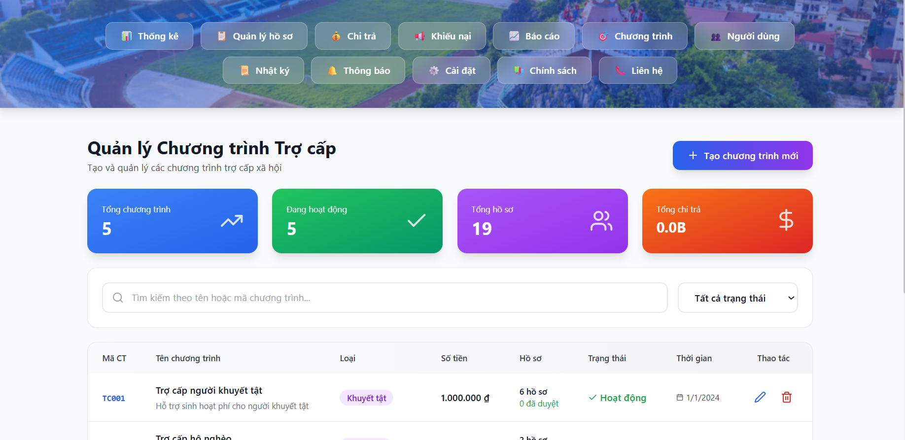
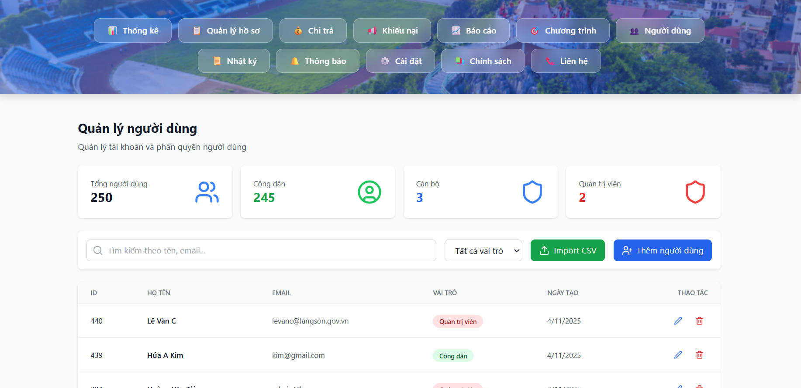

<h2 align="center">
    <a href="https://dainam.edu.vn/vi/khoa-cong-nghe-thong-tin">
    🎓 Faculty of Information Technology (DaiNam University)
    </a>
</h2>

<h2 align="center">
   NETWORK PROGRAMMING
</h2>
<div align="center">
    <p align="center">
        
        
        
    </p>

[](https://www.facebook.com/DNUAIoTLab)
[](https://dainam.edu.vn/vi/khoa-cong-nghe-thong-tin)
[](https://dainam.edu.vn)

</div>

<h1 align="center"> HỆ THỐNG TRỢ CẤP XÃ HỘI TỈNH LẠNG SƠN</h1

---
## 1️. GIỚI THIỆU

Dự án **Hệ thống Quản lý Trợ cấp Xã hội** là một ứng dụng web được xây dựng nhằm hỗ trợ công tác quản lý, giám sát và chi trả các khoản trợ cấp xã hội cho người dân trên địa bàn tỉnh Lạng Sơn. Hệ thống giúp tự động hóa quy trình làm việc từ khâu tiếp nhận hồ sơ, phê duyệt, tạo đợt chi trả, đến theo dõi và thống kê các chương trình trợ giúp xã hội. Được xây dựng trên nền tảng công nghệ hiện đại với React [1], TypeScript [3] cho frontend và Node.js [9], Express [2] cho backend, hệ thống đảm bảo tính minh bạch, chính xác và hiệu quả trong việc quản lý trợ cấp xã hội.

### 🎯 Mục tiêu dự án:
- Tăng tính minh bạch và chính xác trong chi trả trợ cấp.  
- Giảm tải công việc thủ công cho cán bộ xã hội.  
- Giúp người dân dễ dàng tra cứu và theo dõi tình trạng hồ sơ của mình.  
- Tạo cơ sở dữ liệu tập trung phục vụ công tác thống kê, báo cáo nhanh chóng.  

### 👥 Đối tượng sử dụng:
- **Cán bộ quản lý**: thực hiện phê duyệt hồ sơ, cập nhật dữ liệu, quản lý hệ thống.
- **Cán bộ xã/phường**: nhập danh sách đối tượng hưởng trợ cấp.  
- **Người dân**: đăng ký, gửi và theo dõi hồ sơ trợ cấp trực tuyến.  

### Sơ đồ tổng quan hệ thống
  
> Hệ thống được thiết kế theo mô hình Client-Server với kiến trúc 3 lớp (Three-tier Architecture), đảm bảo tính module hóa, dễ bảo trì và khả năng mở rộng trong tương lai.
---

## 2️. CÔNG NGHỆ SỬ DỤNG

| Thành phần | Công nghệ |
|-------------|------------|
| **Frontend** | HTML5, CSS3, JavaScript, TailwindCSS |
| **Backend** | Node.js, Express.js |
| **Cơ sở dữ liệu** | SQLite |
| **Công cụ hỗ trợ** | PostCSS, ESLint |
| **Quản lý gói** | npm |
| **Hệ điều hành khuyến nghị** | Windows / Linux / macOS |
| **IDE khuyên dùng** | Visual Studio Code |

> ⚙️ Dự án được thiết kế theo mô hình **Client–Server**:  
Frontend đảm nhiệm giao diện người dùng, Backend xử lý logic nghiệp vụ và tương tác với cơ sở dữ liệu SQLite lưu trữ thông tin công dân và chương trình trợ cấp.

---

## 3. HÌNH ẢNH CHỨC NĂNG

### Giao diện trang chủ
  
> Giao diện trang chủ là giao diện khi chưa đăng nhập bắt kỳ tài khoản nào vào hệ thống.
> 
> ### Giao diện đăng nhập
  
> Giao diện đăng nhập cho cán bộ và người dân với xác thực tài khoản.

### Giao diện đăng ký hồ sơ
  
> Giao diện cho phép người dân đăng ký hồ sơ trực tiếp.
### Giao diện tra cứu hồ sơ
  
> Giao diện tra cứu hồ sơ cho phép người dân tìm kiếm hồ sơ.

### Giao diện gửi đơn khiếu nại
  
> Giao diện cho phép người dân gửi đơn khiếu nại cũng nhu chính sửa được đơn khi đơn còn ở tình trạng chờ xử lý.

### Giao diện thống kê
  
>Thống kê tổng số hồ sơ, kinh phí chi trả, tỷ lệ phê duyệt.

### Giao diện Quản lý hồ sơ
  
> Cán bộ và Admin tìm kiếm, thêm, sửa, xóa danh sách hồ sơ.

### Giao diện Quản lý chi trả
  
> Cán bộ và Admin thêm, sửa, xóa các đợt chi trả và xuất/ nhập danh sách chi trả.

### Giao diện Quản lý khiếu nại
  
> Cán bộ và Admin tìm kiếm, thêm, sửa, xóa, phân công các đơn khiếu nại.

### Giao diện Báo cáo
  
> Thống kê tổng hợp về hoạt động trợ cấp xã hội.

### Giao diện Quản lý chương trình trợ cấp
  
> Tạo, sửa, xóa và quản lý các chương trình trợ cấp xã hội.

### Giao diện Quản lý người dùng
  
> Quản lý tài khoản và phân quyền người dùng.

### Giao diện Nhật ký hệ thống
  s
> Theo dõi mọi hoạt động trong hệ thống.

---

## 4️. CÁC BƯỚC CÀI ĐẶT

### 🔧 Yêu cầu hệ thống:
- **Node.js:** >= 16.0.0  
- **npm:** >= 8.0.0  
- **Trình duyệt hỗ trợ:** Chrome, Edge, Firefox  

### ⚙️ Các bước thực hiện:
```bash
# 1. Giải nén dự án
unzip Tro_Cap_Xa_Hoi.zip
cd Tro_Cap_Xa_Hoi

# 2. Cài đặt các gói phụ thuộc
npm install

# 3. Chạy môi trường phát triển
npm start

# 4. Mở trình duyệt và truy cập địa chỉ
http://localhost:3000

# (Tùy chọn) Build dự án để triển khai
npm run build
```
---

## 5. Liên hệ
Nếu bạn có bất kỳ thắc mắc hoặc góp ý nào về hệ thống, vui lòng liên hệ qua các thông tin sau:

- 👤 **Tác giả:** Phạm Thị Hồng Ngọc
- 🎓 **Lớp:** Công nghệ thông tin 
- 🏫 **Trường:** Đại học Đại Nam  
- 📧 **Email:** pthn2488@gmail.com  
- 📞 **SĐT:** 0395 888 778


Cảm ơn bạn đã quan tâm và sử dụng hệ thống hỗ trợ trợ cấp xã hội! ❤️
